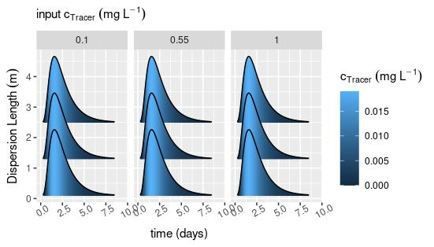

```{r, include = FALSE}
knitr::opts_chunk$set(
  collapse = TRUE,
  comment = "#>"
)
options(tibble.print_min = 4L, tibble.print_max = 4L)
options(rmarkdown.html_vignette.check_title = FALSE)
```
# r2ogs5 ensembles

An ensemble refers to several simulations of the same type with different input parameters. Here a set of helper functions are presented in order to set up and run an ensemble. 


1. [Prerequisites](#inst)
2. [Simulation setup](#setup) 
3. [Preprocessing](#preproc)
4. [Ensemble run](#sim)
5. [Postprocessing](#post)
6. [Visualization](#viz)


## Prerequisites  <a name="inst"></a>

Before being able to run any simulation, the package r2ogs needs to be installed 
via 
```{r, eval=FALSE}
devtools::install_git("https://gitlab.opengeosys.org/ogs5/r2ogs5")
# alternatively:
remotes::install_git("https://gitlab.opengeosys.org/ogs5/r2ogs5")
```
in R or
```{bash, eval=FALSE}
git clone https://gitlab.opengeosys.org/ogs5/r2ogs5.git
cd r2ogs5
R --slave -e 'devtools::install(".")'
```
from a terminal, requiring the package *devtools* being installed in the systems R library.


```{r}
library(r2ogs5)
```
```{r, echo= FALSE, eval=TRUE}
options(r2ogs5.default_ogs5_bin = search_ogs5_bin_path(ogs_exe = "ogs_fem", return_ogs5_bin = TRUE))
```
An appropriate *OGS5* executable has to be compiled or downloaded and the name
(here ogs_fem) and location of the OGS5 executable have to be set accordingly
via `options`, for example:
```{r, eval=FALSE}
options(r2ogs5.default_ogs5_bin = "/usr/local/bin/ogs_fem")
```


**Note:** In order to install the package with vignettes, e.g. by calling 

```{r, eval=FALSE}
devtools::install_git("https://gitlab.opengeosys.org/ogs5/r2ogs5", build_vignettes = TRUE)
```
a basic ogs5 executable named "ogs_fem" must be available in the search path. For Linux, the executable should be in one of the directories found when entering `Sys.getenv("PATH")` in the R console. For Windows, it should be located in *"C:/Programme/OpenGeoSys/bin/"* or *"C:/Programs/OpenGeoSys/bin/"* under the current implementation.  

## Simulation setup <a name="setup"></a>
Before setting up the ensemble, a base *ogs5* simulation has to be defined.
The input files will be read in from an already set up simulation, whose input files should be in the directory specified in `temp_dir`. The same 
hydraulic transport model is utilized as in `vignette("r2ogs5")`, for the creation of the
input files used here please refer to this vignette. 
```{r, results='hide'}
temp_dir <- "tmp"
ex1 <- create_ogs5(sim_name = "ex1", sim_id = 1L,
                   sim_path = temp_dir)
```

```{r, results='hide', eval = TRUE, echo=FALSE}
ex <- create_ogs5(sim_name = "ex1", sim_id = 1L,
                   sim_path = temp_dir)
# this chunk is not visible in the vignette but ensures that the files exist in the
# directory when the vignette is built.
ex <- input_add_pcs_bloc(x=ex, pcs_name = "waterflow", PCS_TYPE = "LIQUID_FLOW",
                          PRIMARY_VARIABLE = "PRESSURE1")
ex <- input_add_pcs_bloc(x=ex, pcs_name = "tracer",
                          PCS_TYPE = "MASS_TRANSPORT",
                          PRIMARY_VARIABLE = "Tracer1",
                          RELOAD = c("1", "1"))

ex <- input_add_bc_bloc(x=ex, bc_name = "pressure_out",
                         PRIMARY_VARIABLE = "PRESSURE1",
                         DIS_TYPE = "CONSTANT 9810",
                         PCS_TYPE = "LIQUID_FLOW",
                         GEO_TYPE = "POINT point1")

ex <- input_add_bc_bloc(x=ex, bc_name = "tracer_in",
                         PRIMARY_VARIABLE = "Tracer",
                         DIS_TYPE = "CONSTANT 1.19438",
                         PCS_TYPE = "MASS_TRANSPORT",
                         GEO_TYPE = "POINT point0",
                         TIM_TYPE = "CURVE 1")

ex <- input_add_ic_bloc(x = ex, ic_name = "pressure",
                         PCS_TYPE = "LIQUID_FLOW",
                         PRIMARY_VARIABLE = "PRESSURE1",
                         GEO_TYPE = "DOMAIN",
                         DIS_TYPE = "CONSTANT 9810")

ex <- input_add_ic_bloc(x = ex, ic_name = "tracer",
                         PCS_TYPE = "MASS_TRANSPORT",
                         PRIMARY_VARIABLE = "Tracer",
                         GEO_TYPE = "DOMAIN",
                         DIS_TYPE = "CONSTANT 0.0")

ex <- input_add_mcp_bloc(x = ex,
                          NAME = "Tracer",
                          MOBILE = 1)

ex <- input_add_mfp_bloc(x = ex, FLUID_NAME = "water",
                          FLUID_TYPE = "LIQUID",
                          DENSITY = "1 1.0E+3",
                          VISCOSITY = "1 1.0E-3")

ex <- input_add_mmp_bloc(x = ex, GEOMETRY_DIMENSION = "1",
                          GEOMETRY_AREA = "1.2",
                          POROSITY = "1 0.38",
                          PERMEABILITY_TENSOR = "ISOTROPIC 1.0E-8",
                          MASS_DISPERSION = "1 1.0",
                          TORTUOSITY = "1 1.0",
                          NAME = "gravel")

ex <- input_add_msp_bloc(x = ex, NAME = "gravel" ,
                          DENSITY = "1 1.8E+3")

ex <- input_add_num_bloc(x = ex, num_name = "waterflow",
                          PCS_TYPE = "LIQUID_FLOW",
                          LINEAR_SOLVER = "2 6 1.0E-14 100 1.0 100 4")

ex <- input_add_num_bloc(x = ex, num_name = "tracer",
                          PCS_TYPE = "MASS_TRANSPORT",
                          LINEAR_SOLVER = "2 6 1.0E-14 100 1.0 100 4")

ex <- input_add_out_bloc(x = ex, out_name = "waterflow",
                          PCS_TYPE = "LIQUID_FLOW",
                          NOD_VALUES = "PRESSURE1\n VELOCITY_X1",
                          GEO_TYPE = "DOMAIN",
                          DAT_TYPE = "PVD",
                          TIM_TYPE = "STEPS 10")

ex <- input_add_out_bloc(x = ex, out_name = "tracer",
                          PCS_TYPE = "MASS_TRANSPORT",
                          NOD_VALUES = "Tracer",
                          GEO_TYPE = "DOMAIN",
                          DAT_TYPE = "PVD",
                          TIM_TYPE = "STEPS 10")

ex <- input_add_out_bloc(x = ex, out_name = "tracer_tec",
                          PCS_TYPE = "MASS_TRANSPORT",
                          NOD_VALUES = "Tracer",
                          GEO_TYPE = "DOMAIN",
                          DAT_TYPE = "TECPLOT", TIM_TYPE = "STEPS 1")

ex <- input_add_st_bloc(x = ex, st_name = "waterflow",
                         PCS_TYPE = "LIQUID_FLOW",
                         PRIMARY_VARIABLE = "PRESSURE1",
                         GEO_TYPE = "POINT point0",
                         DIS_TYPE = "CONSTANT_NEUMANN 7.8611E-06")

ex <- input_add_tim_bloc(x = ex,  tim_name = "waterflow",
                          PCS_TYPE = "LIQUID_FLOW",
                          TIME_START = "0",
                          TIME_END = "36000000",
                          TIME_STEPS = "229 3600")

ex <- input_add_tim_bloc(x = ex,  tim_name = "tracer",
                          PCS_TYPE = "MASS_TRANSPORT",
                          TIME_START = "0",
                          TIME_END = "36000000",
                          TIME_STEPS = "229 3600")

ex <- input_add_rfd_bloc(x = ex, rfd_name = "tracer",
                          mkey = "CURVES",
                          data = tibble::tibble(
                            time = c(0, 3600, 3600.1, 720, 36000000),
                            conc = c(1,1,0,0,0)))
ex <- input_add_gli_points(x = ex,
                            ogs5_points = tibble::tibble(
                              x = c(0, 4.7),
                              y = c(0,0),
                              z = c(0,0),
                              name = c("point0", "point1")))
# ad msh bloc
mesh_lst <- create_structured_mesh_nodes_ele(lx = 4.7, nx = 94)
ex <- input_add_msh_bloc(x = ex, msh_name = "base_mesh",
                          NODES = mesh_lst$NODES,
                          ELEMENTS = mesh_lst$ELEMENTS) 
ogs5_write_inputfiles(ex, type = "all")
```


```{r, results='hide'}
ex1 <- input_add_blocs_from_file(
  ogs5_obj = ex1, 
  sim_basename = "ex1",
  filename = "all",
  file_dir = temp_dir # the directory where input files were written to in 
                      # vignette("r2ogs5")
  )
```


## Preprocessing  <a name="preproc"></a>

Define a parameter table for the ensemble for two parameters that will be arranged on a grid. Here, every combination of 10 mass dispersion and 5 tracer input concentrations  is a point on the grid thus resulting in 50 points/rows in the table. This can be easily extended to more parameters, but it has to be kept in mind that the number of points is the product of the parameter sequences every point corresponds to a simulation run.
```{r results = "markup"}
para_df <-
  expand.grid(mass_dispersion = seq(0.1, 2.5, length.out = 3),
              tracer_input_concentration = seq(0.1, 1, length.out = 3)) %>% 
            tibble::as_tibble()

head(para_df)
```
Next, an ensemble object of class *ens* is created, where all the information is stored and a path to the directory where ensemble files should be written. 
```{r}
ens1 = create_ens(base_sim = ex1, parameter_tbl = para_df,
                  name = "tracersim",
                  path = temp_dir)
names(attributes(ens1))

```

In a simple loop, each parameter combination can be changed in the base simulation by overwriting a temporary *ogs5* object "tmp_ogs5" and then adding it to the ensemble with the helper function `ens_add_ogs5`. 

```{r}
# ensemble_add_sims <- functoin(ensemble = list())
# add sims
for (i in 1:dim(attributes(ens1)$sim_plan)[1]) {
  # define new ogs5 obj based on attributes(ens1)$base_sim
  tmp_ogs5 <- attributes(ens1)$base_sim
  
  # set parameters
  tmp_ogs5$input$mmp$gravel$MASS_DISPERSION <- paste(
    "1 ",
    round(attributes(ens1)$sim_plan[i, "mass_dispersion"], 2)
    )
  
  tmp_ogs5$input$bc$tracer_in$DIS_TYPE <- paste(
    "CONSTANT",
    attributes(ens1)$sim_plan[i, "tracer_input_concentration"]
    )
  
  # add to ens1
  ens1 <- ens_add_ogs5(x = ens1, ogs5_obj = tmp_ogs5)
}
```

With another helper function, a new folder "tracersim" will be created in "tmp" and input files will be written into corresponding numbered sub-folders in the specified ensemble path. The general folder structure is:  

ensemble_path/  
\ \ \ \ - ensemble_name/  
\ \ \ \ \ \ \ \ - ensemble_name1  
\ \ \ \ \ \ \ \ - ensemble_name2  
\ \ \ \ \ \ \ \ - ...  

```{r}
ens_write_inputfiles(ens1)
```


## Simulate  <a name="sim"></a>

The simulations are executed with the wrapper function `ens_run` that calls the function `ogs5_run`. Documentation is available under `?ogs5_run`.
```{r, results='hide', warning=FALSE, message=FALSE}
ens_run(ens1,
        ogs_exe = NULL, # default path will be used
        log_output = TRUE,
        wait = TRUE)

```

The output defined in the third output block is read in next.
```{r, results='hide', message=FALSE, warning=FALSE}
ens1 <- ens_get_output(ens1, type = "specific", list("OUTPUT3"))
```
```{r}
ens1$sim1$output$OUTPUT3[[1]] %>% head
```

## Postprocessing  <a name="post"></a>  
For every simulation of the ensemble, there exists a *tibble* in `$output`. In order to use the plotting grammar from **ggplot2**, a single data table in long format is often useful. Therefore, the data from is stacked into a single *tibble* with the code below. A new column called "sim_name" keeps track of which results belong to which simulations.

```{r}
# create tibble of all outputted *.tec files
tracer_out_df <- tibble::tibble()

for (i in 1:length(ens1)){
  tracer_out_df <-
    tracer_out_df %>% 
    dplyr::bind_rows(
      ens1[[i]]$output$OUTPUT3[[1]] %>%
        dplyr::mutate(sim_name = attributes(ens1[[i]])$sim_name)
      )   
}
```

Next, the parameter table, for which simulations were run is matched with the respective simulation output by the column `sim_name`. 

```{r}
tracer_out_df <-
  tracer_out_df %>% 
                  dplyr::filter(X == 4.7) %>% 
                  dplyr::left_join(attributes(ens1)$sim_plan,
                                   by= "sim_name") %>% 
                  dplyr::mutate(TIME = TIME/(3600*24))
```


## Visualization  <a name="viz"></a>

An overview of the effect on the simulation of the different parameters can be achieved by plotting, if there are not too many parameters. Here, the Tracer concentration at the last point (`x = 4.7`) is plotted over time as so-called breakthrough curves. It can be observed that both increasing tracer input concentration and result in slightly fatter tails of the curve.
```{r, eval=FALSE, fig.asp=0.5, fig.width=8}

g <- tracer_out_df %>%
  dplyr::filter(X == 4.7) %>%

  ggplot2::ggplot(ggplot2::aes(
    x = TIME, 
    y = mass_dispersion,
    height = Tracer,
    group = mass_dispersion,
    fill = Tracer
    ))+
    ggridges::geom_density_ridges_gradient(stat = "identity",
                                           rel_min_height = 0.01,
                                           panel_scaling = TRUE)+

    ggplot2::facet_grid(.~tracer_input_concentration)+

    ggplot2::theme(
      axis.text.x.bottom = ggplot2::element_text(angle = 30)
      )+
    ggplot2::labs(x = "time (days)",
        subtitle = expression(input~c[Tracer]~(mg~L^{-1})),
        y = expression(Dispersion~Length~(m)),
        fill = expression(c[Tracer]~(mg~L^{-1}))
    )
```


